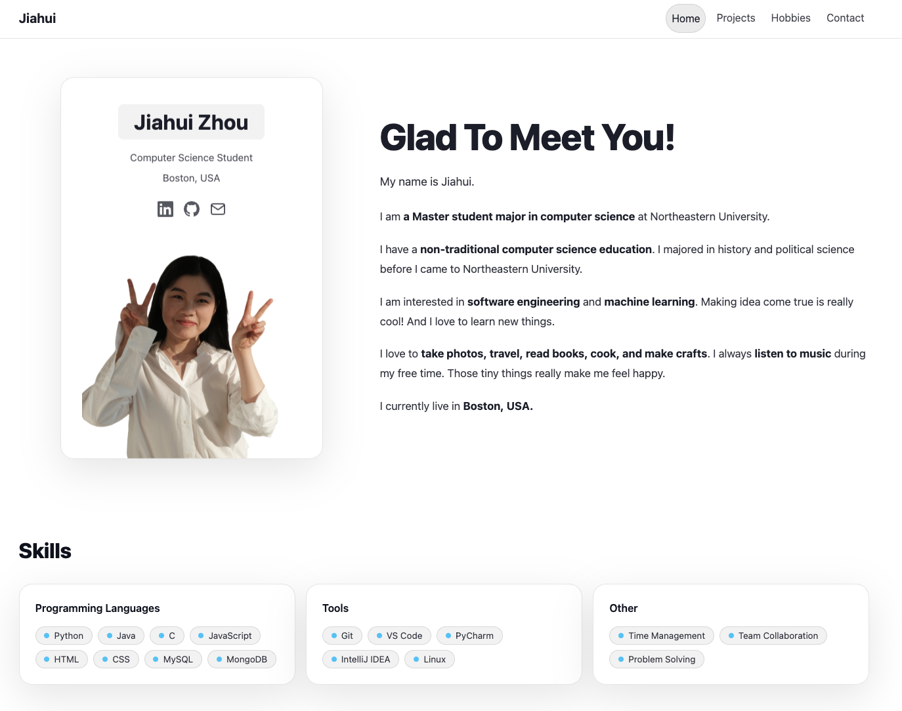
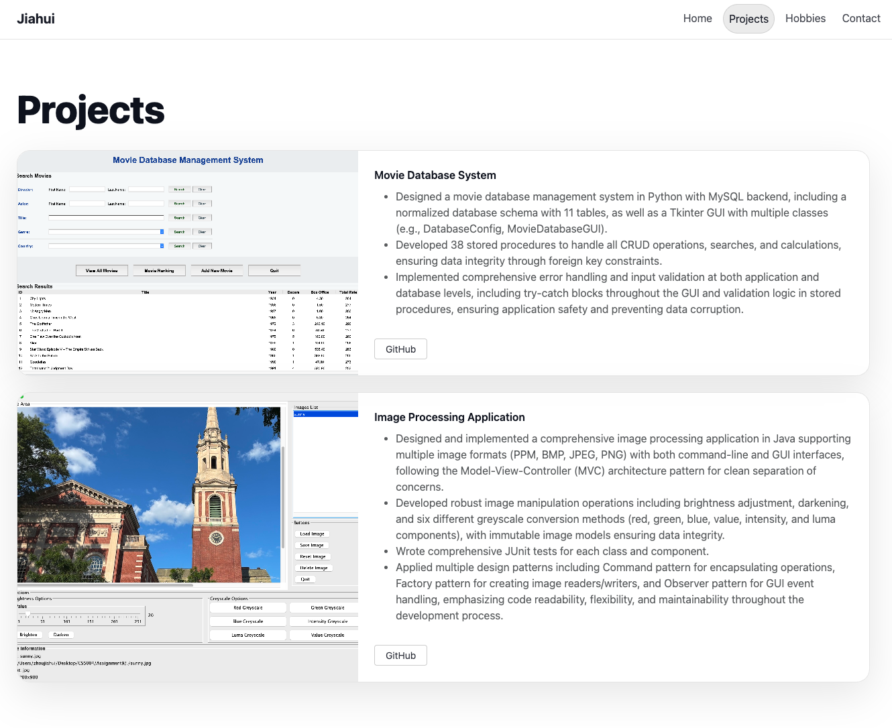
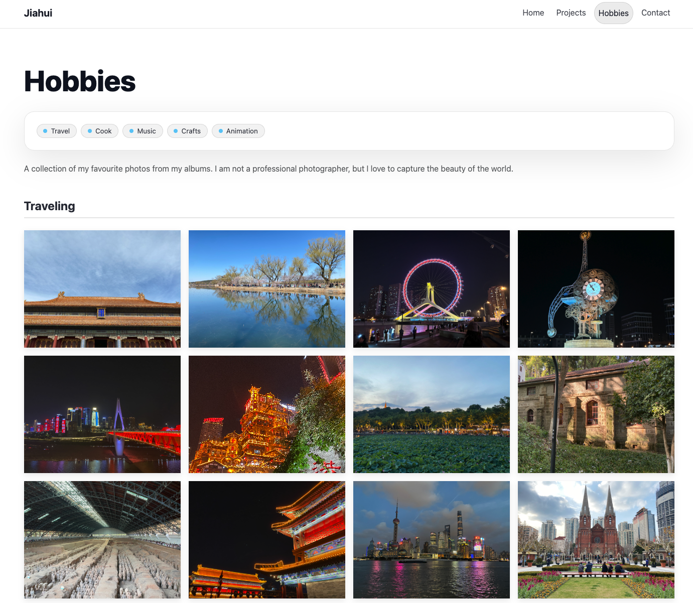
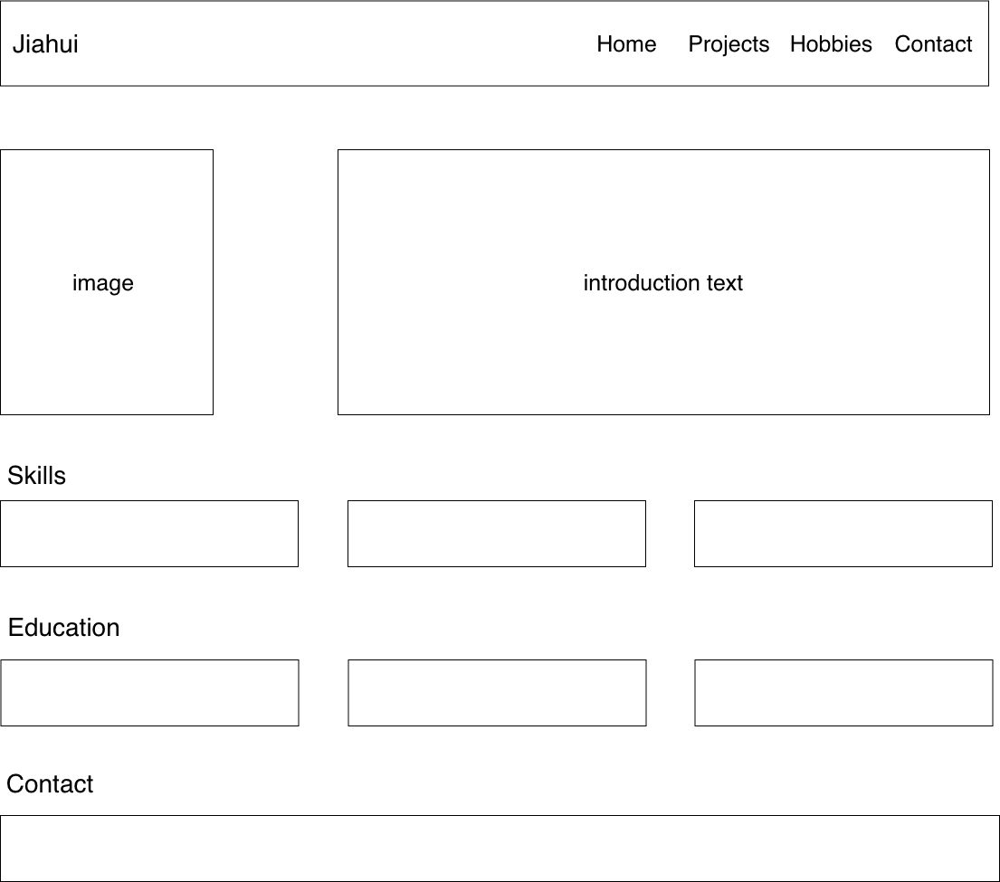

# Personal Website

## Project Name

Jiahui's Personal Webstie

## Author

Jiahui Zhou

## Website Link

You could go to my website by clicking here:
[https://jiahui-zhou98.github.io/Personal-Website/]

## Class Link

This project is part of my web development course. Here is the class link:
[https://johnguerra.co/classes/webDevelopment_online_spring_2026/]

## Project Objective

This is a personal website showcasing my background, skills, projects, and hobbies as a Computer Science student at Northeastern University. The website serves as a professional portfolio and personal introduction page.

## Screenshot





## Instructions to Build

### Prerequisites

- Node.js (v14 or higher)
- npm (Node Package Manager)

### Installation Steps

1. **Clone the repository**

   ```bash
   git clone [repository-url]
   cd personal-website
   ```

2. **Install dependencies**

   ```bash
   npm install
   ```

3. **Run linting (optional)**

   ```bash
   npm run lint
   ```

4. **Format code with Prettier**

   ```bash
   npx prettier --write "**/*.{html,css,js}"
   ```

5. **Open in browser**
   - Simply open `index.html` in your web browser
   - Or use a local server:

     ```bash
     # Using Python
     python -m http.server 8000

     # Using Node.js http-server
     npx http-server
     ```

### Project Structure

```
personal-website/
├── index.html          # Homepage
├── projects.html       # Projects page
├── hobbies.html        # Hobbies page
├── styles/
│   └── main.css       # Custom styles
├── js/
│   └── main.js        # Custom JavaScript
├── images/            # Image assets
├── package.json       # Dependencies
└── README.md         # This file
```

## Features

- Responsive design using Bootstrap 5
- Glass morphism UI effects
- Interactive tooltips
- ES6 modules
- W3C compliant HTML

## GenAI Tools Usage

### Tools Used

- **ChatGPT 5.2**: Used for code generation and assistance (for homepage structure, especially the navigation bar and the profile card)
- **Claude Sonnet4.5**: Used for content suggestions

### Prompts Used (for the home page structure)

- Create a personal website using HTML5, CSS3 and Bootstrap5. In the homepage, I need to have a fixed navigation bar on the top of the webpage(logo on the left, navigation links on the right), then an introduction section and a photo card in the hero section(profile card on the left, and introduction text on the right), followed by a skills section, an education section and a contact section. The picture is my draft of the website, please use bootstrap grid to generate related structure. Make the website simple and beautiful.

#### Sketch used



### How GenAI Was Used

- **Code Structure**: AI assisted in setting up the project structure and Bootstrap integration
- **Styling**: AI helped generate CSS for glass morphism effects
- **Documentation**: AI assisted in creating this README and documentation

### References

- Thanks a lot for those fantastic websites and their owners, I really learn a lot from them.
- Beautiful websites: [https://lachlanjc.com/] [https://amankumar.ai/] [https://maxeisen.me/] [https://piraffe.com/] [https://www.boag.online/] [https://antfu.me/] [https://jms.dev/] [https://rafa.design/]

## License

MIT License - see LICENSE file for details

## Deployment

This website was deployed on GitHub Pages

## Video Demonstration

See the video demonstration by clicking this link: https://drive.google.com/file/d/18KGGMo7jIc0AbKAkd1MltRiS2zsX_FPK/view?usp=drive_link

## Slides

See slides for this project here: https://docs.google.com/presentation/d/1KW71to-wE99S71C6HTrOjQ7rdq--Sur9yYRPZuiyXSg/edit?usp=sharing

## Design Document

- [Design Document](Design%20Document.pdf)
